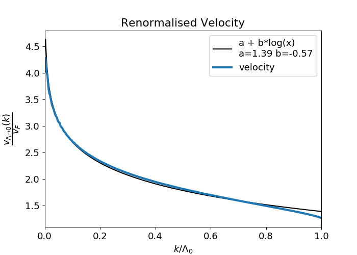
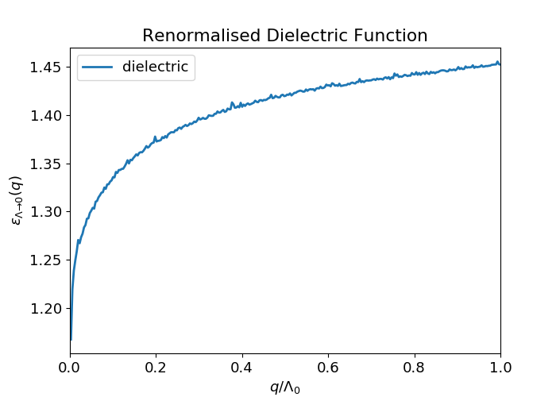
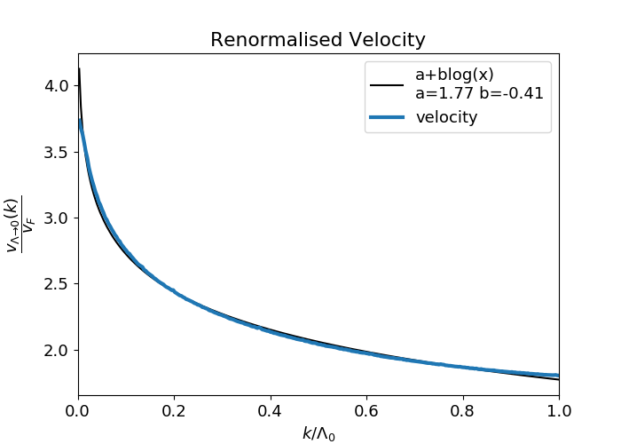
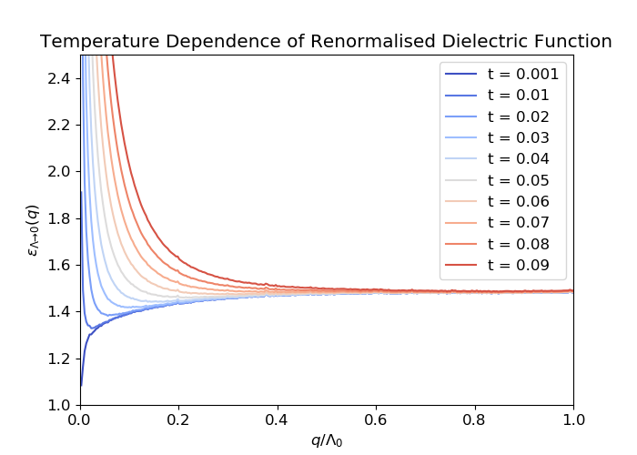

# Renoramlisation of Fermi Velocity in Graphene
---
This repository contains some code for the renormalisation of Fermi
velocity and Dielectric Function of Graphene. We used the
non-perturbative methods used in the paper by [Bauer, Rückriegel, Sharma and
Kopietz](http://dx.doi.org/10.1103/PhysRevB.92.121409). 

### File Structure
---

```bash
.
├── bauer
├── coupled2
├── finite_temp2
├── pole
├── polecorr
├── zero_momentum
├── non_perturbative.pdf
└── README.md
```

### Contents
---
The folder bauer contains the code for the exact equations stated in
the paper cited above. In the coupled2 folder we have restricted also
the bosonic momenta to lie in the shell to be integrated out. Finally,
in the frequency folder we used the velocity calculated in earlier
methods and introduced the frequency dependence to the dielectric
function.

The pdf file contains the details of the calculations and the
equations that are used in the codes.

### Results
---





#### Bosonic momenta inside momentum shell




#### Temperature Dependence


